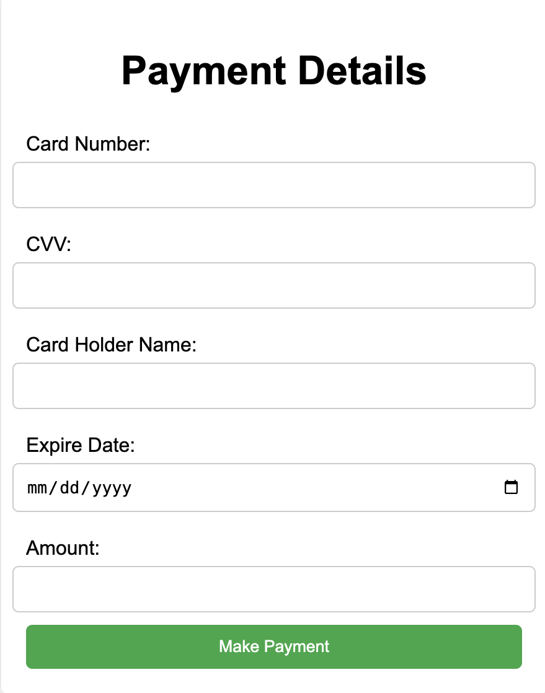
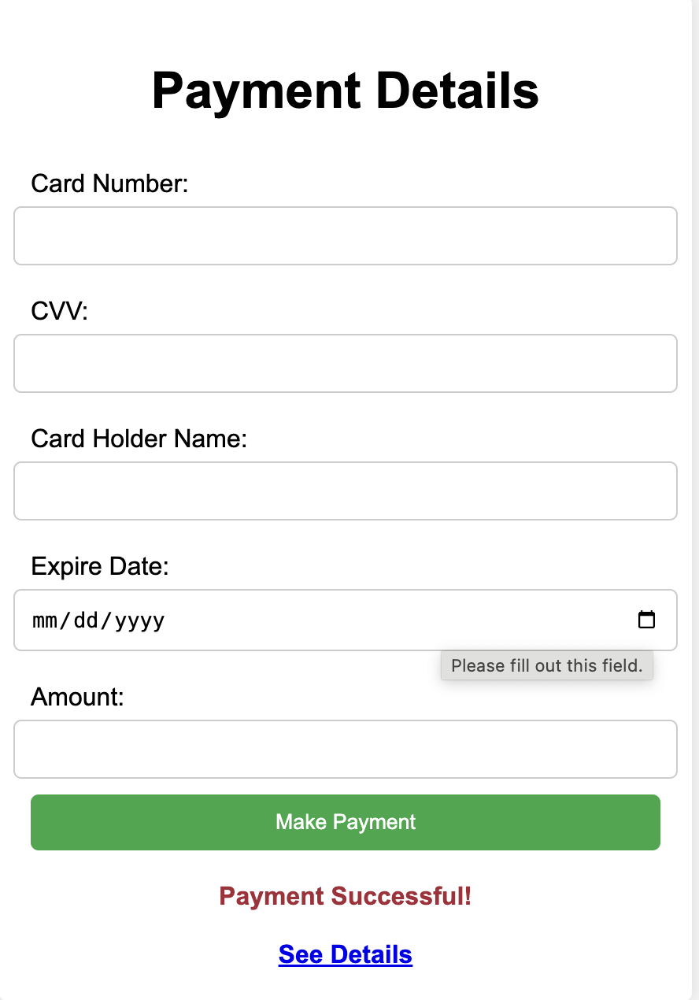
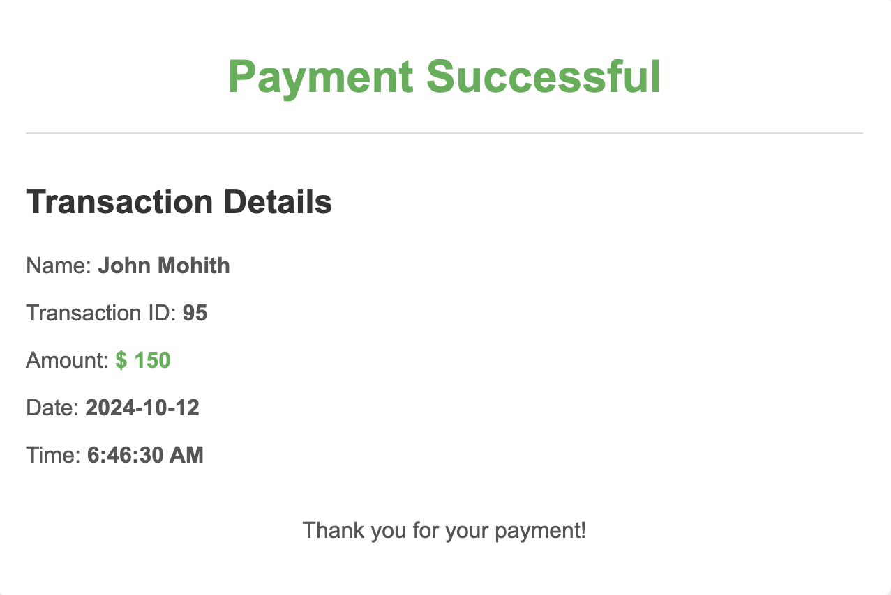

# FakePaymentGateWay

# Requirements
1. javascript, html, css for frontend
2. python for backend
3. MySQL for database
# Setup Environment

```
python -m venv api_gateway
conda activatye api_gateway
pip install -r requirements.txt
```
`or`
```
conda env create -f environment.yml
conda activate api_gateway
```
# Run the Server
```
python app.py
```
# Play with the UI

Go to `templates` directory and open `index.html` in a browser


# API call
## To get transaction details, you can use the following API call:

`GET `
```
http://127.0.0.1:5000/transaction_id/1
```

Replace the `1` with the actual payment ID.

# Response
The response will be in JSON format and will contain the following fields:

- `Massage`: "Transaction Successful"
- `Payment Id`: The payment ID of the transaction
- `Name`: The name of the card holder
- `Amount`: The amount of the transaction
- `Date of Transaction`: The date of the transaction in ISO format
- `Time of Transaction`: The time of the transaction in ISO format  

## To get all the transactions, you can use the following API call:
`GET `
```
http://127.0.0.1:5000/GetTransactions
```

# Response
The response will be in JSON format and will contain an array of transactions. Each transaction will have the following fields:

- `Payment Id`: The payment ID of the transaction
- `Name`: The name of the card holder
- `Amount`: The amount of the transaction
- `Date of Transaction`: The date of the transaction in ISO format
- `Time of Transaction`: The time of the transaction in ISO format     
- `Card Number`: The card number of the transaction
- `CVV`: The CVV of the transaction
- `Card Holder Name`: The card holder name of the transaction
- `Expire Date`: The expire date of the transaction

To post a new transaction, you can use the following API call:

`POST`
```
http://127.0.0.1:5000/AddTransactions
```

With the following JSON body:

```json
{
    "card_number": "1234567890123456",
    "cvv": "123",
    "card_holder_name": "John Doe",
    "expire_date": "2028-01-01",
    "amount": 5000,
    "date": "2023-01-01",
    "time": "12:00:00"
}
```

This will add a new transaction to the database and return the payment ID of the transaction.

# Access from Anywhere
1. Please create an account in [ngrok](https://dashboard.ngrok.com/get-started/setup/macos) and access all the mentioned apis from anywhere in the world by replacing `http://127.0.0.1:5000` with `https://something.ngrok-free.app`.

# Screenshots



